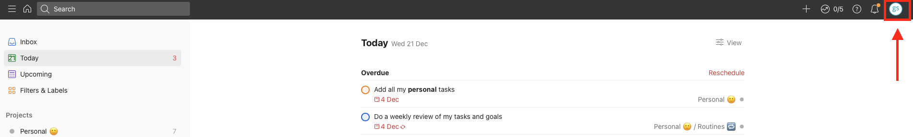
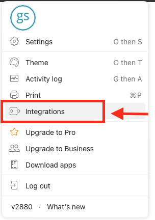
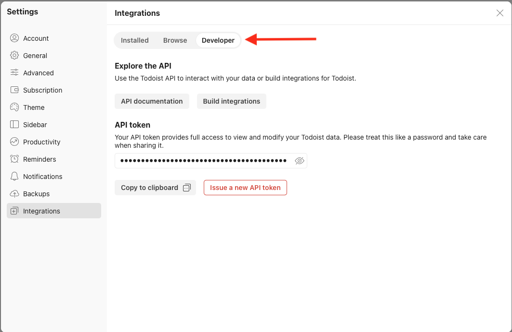
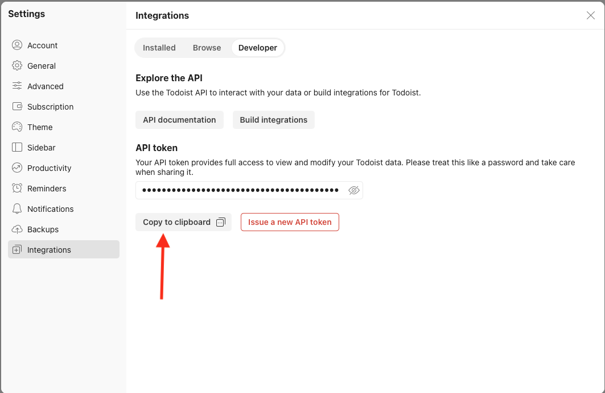

# Pre-Requisites

You'll need to install the SyncTodoist package and get an API key from Todoist to get started.  

## Installing

Installing SyncTodoist is very simple. 

**Step 1**  
Open your terminal

**Step 2**  
Create and activate your virtual environment. If you're not sure how to do this, check out 
[Python Virtual Environments on RealPython.com](https://realpython.com/python-virtual-environments-a-primer/).  

**Step 3**  
Install SyncTodoist  
```shell
pip install synctodoist
```

You're ready to roll.

## Getting a Todoist API key

You'll need an API key to interact with Todoist. To get one, just follow these steps:

**Step 1**  
Open your browser and navigate to <a href="https://todoist.com" target="_blank">todoist.com</a>.  

**Step 2**  
If you're not logged in yet, log in to your account.  

**Step 3**  
Click on your initials in the upper right hand corner.  


**Step 4**  
Click on `Integrations`.  


**Step 5**  
Click on `Developer`.


**Step 6**  
Click `Copy to clipboard` to copy your API key to the clipboard.


???+ Important
    Make sure to keep this API key safe and don't share it with anybody. Also, don't commit it to any git repository. The API key is as good as your user name
    and your password when accessing Todoist.